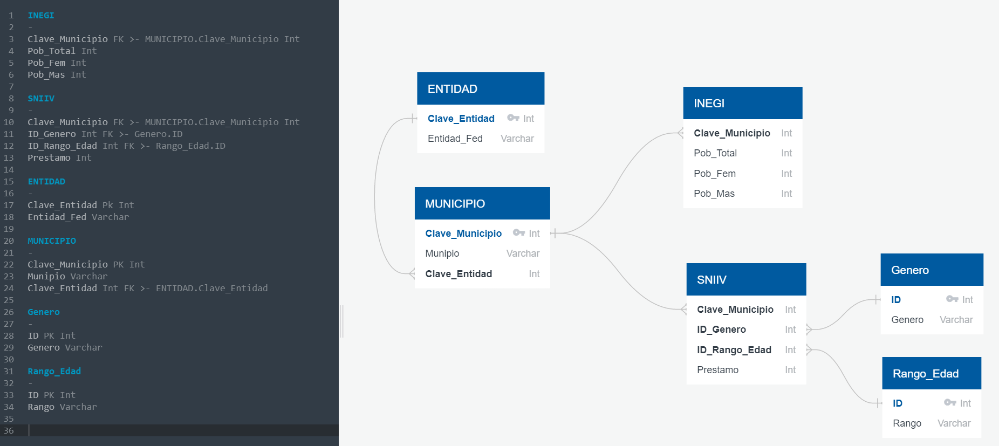

# _ETL-Project_

## Project Title:

Housing loans analysis for Mexican Municipalities.

## Team Members: 

Carlos Rafael, Gustavo Maldonado, Juan Cortez & Marcelo Flores.

## Project Proposal: 

The objective is to perform and ETL (extract, transform, load) to analyze housing credit loans that have general data from the applicants and combine it with housing and spending data from municipalities and states in Mexico to get better insights. 

## ETL Process:
To achieve the objective for the project the following steps were taken:

### Extraction
Data was acquired from two different CSV sources: 1) from INEGI (Instituto Nacional de Estadística y Geografía) and 2)SNIIV (Sistema Nacional de Información e Indicadores de Vivienda).

Sources:
https://www.inegi.org.mx/programas/ccpv/2020/default.html#Datos_abiertos
https://sniiv.conavi.gob.mx/reportes/datos_abiertos.aspx

INEGI Data set contains 232 columns x 195,663 rows. This Dataset contains housing and population data from the 2020 census.

SNIIV Data sets contains 16 columns x 355,375 rows. This Dataset contains financing and loans awarded for housing actions (Acquisition and maintenance of homes, payment of mortgages, etc.).

### Transformation

A. Concatenate elements from both data sets were chosen for their similarities
- “Clave de Entidad”
- “Clave de Municipio”

B. Creation of a Schema for the relational database utilizing app QuickDBD.

C. Data was transformed for readability using Jupyter Notebook, in the following order:
- Load Datasets to pandas as Data Frames.
- Filter columns for analysis.
- Change and match the names of columns.
- Normalize data by creating different tables from the original datasets.
- The following books were created within Jupyter notebooks:
i. Entidad_table
ii. municipality_table
iii. end_inegi_df
iv. sniiv_final_df
v. gender_df
vi. rango_edad_df		
- Remove rows with summary data by municipality.

### LOAD

The team determined the best direction to move towards was to use a relational database to maintain integrity of the information provided in the initial datasets, avoiding changes that could affect the database, when new information is loaded or changed.

A.	Create Database on pgAdmin.
B.	Run schema file (queries.sql) to add tables and constraints.
C.	Connect Jupyter notebook to SQL databases.
D.	Loaded information into database.
E.	Perform Queries
